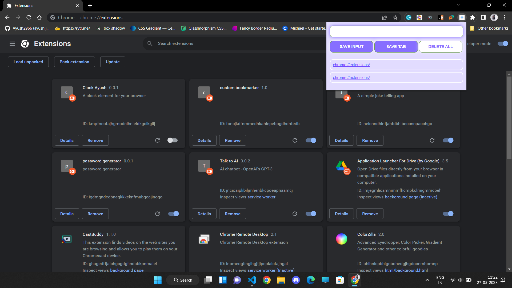

# Bookmarker
A Chrome Extension which can be used to bookmark any website.
# Preview

# How it works?
* To save (bookmark) current tab, you just have to click on Save-Tab button.
* To bookmark any website you have to input it's URL in the input section and then click on Save-Input button.
* To delete all the bookmarks stored,  you have to double click on delete all button.
