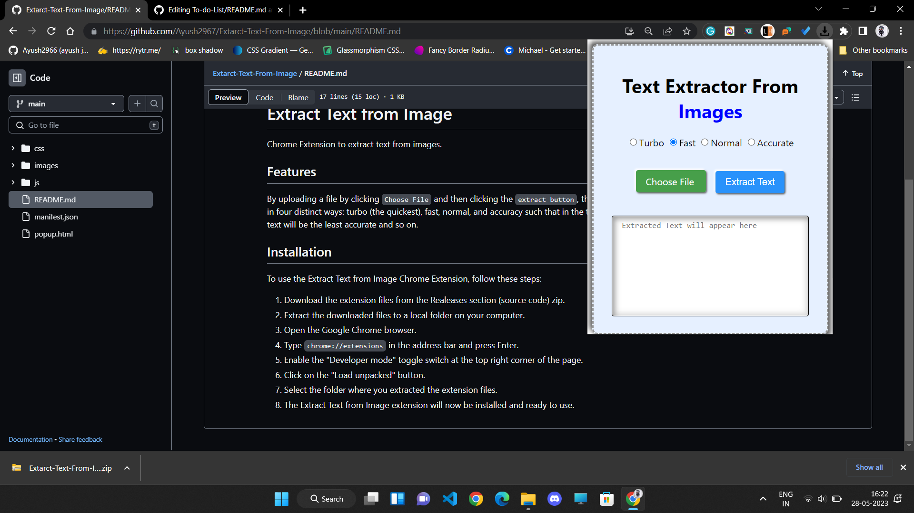

# Extract Text from Image
Chrome Extension to extract text from images.
## Features
By uploading a file by clicking `Choose File` and then clicking the `extract button`, the extension extracts text from the image.
It extracts text in four distinct ways: turbo (the quickest), fast, normal, and accuracy such that in the turbo method the extraction is fastest and the extracted text will be the least accurate and so on.
## Installation

To use the Extract Text from Image Chrome Extension, follow these steps:

1. Download the extension files from the Realeases section (source code) zip.
2. Extract the downloaded files to a local folder on your computer.
3. Open the Google Chrome browser.
4. Type `chrome://extensions` in the address bar and press Enter.
5. Enable the "Developer mode" toggle switch at the top right corner of the page.
6. Click on the "Load unpacked" button.
7. Select the folder where you extracted the extension files.
8. The Extract Text from Image extension will now be installed and ready to use.
 
## Preview

 

 Made with ❤️ by Ayush Jain

