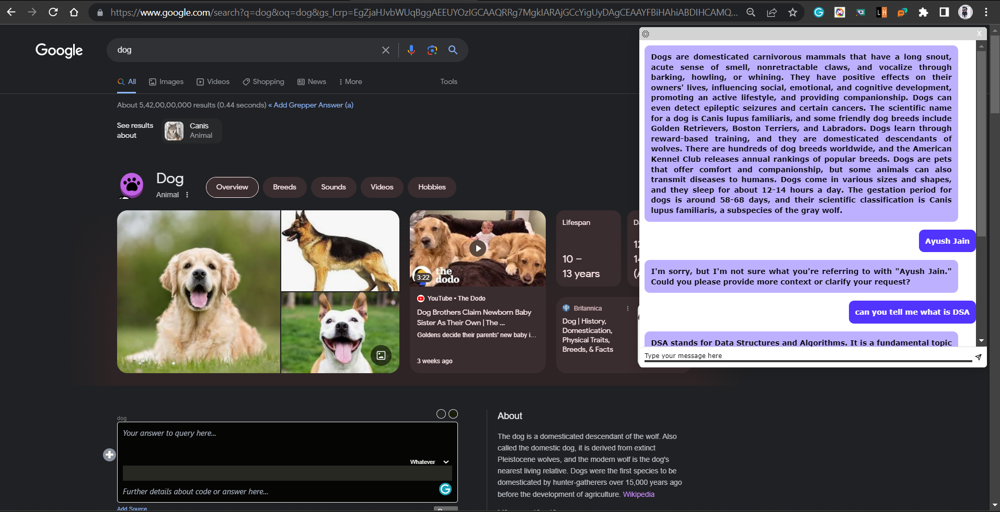

# Talk-to-AI 🤖
**Talk to AI** is a powerful chrome extension that enhances your browsing experience by providing summarized insights and facilitating interactive conversations about the web content. Using **ChatGPT**, you may go deep into the substance of web pages, engage in discourse, and obtain a full grasp of the topic. 

## Installation
1. Download the extension files from the Realeases section (source code) zip.
2. Extract the downloaded files to a local folder on your computer.
3. Open the Google Chrome browser.
4. Type `chrome://extensions` in the address bar and press Enter.
5. Enable the "Developer mode" toggle switch at the top right corner of the page.
6. Click on the "Load unpacked" button.
7. Select the folder where you extracted the extension files.
8. The Extract Text from Image extension will now be installed and ready to use.

# For Example:-

 Made with ❤️ by Ayush Jain 

