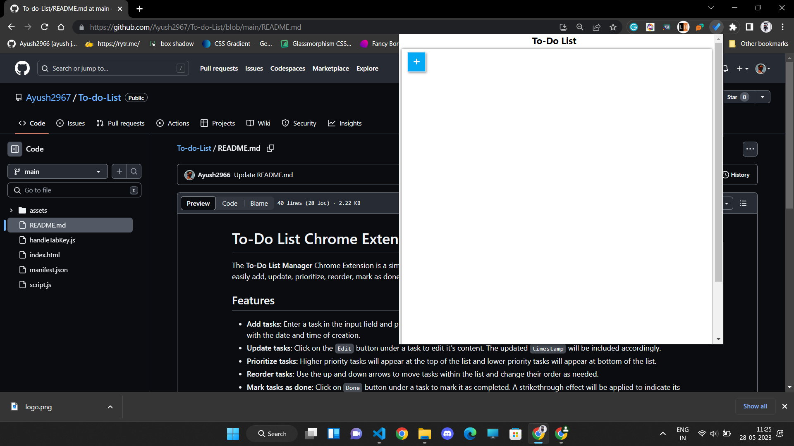
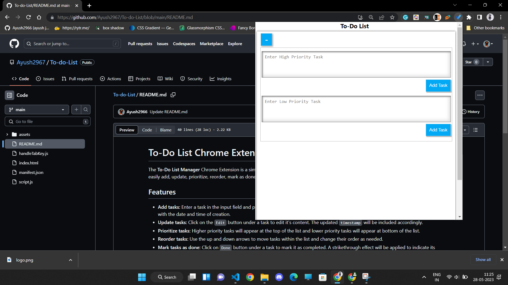
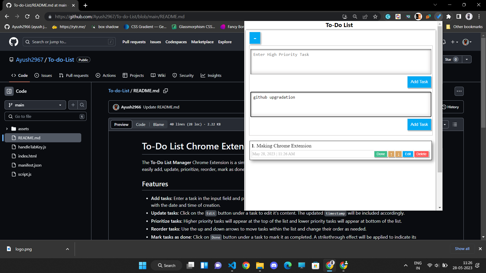
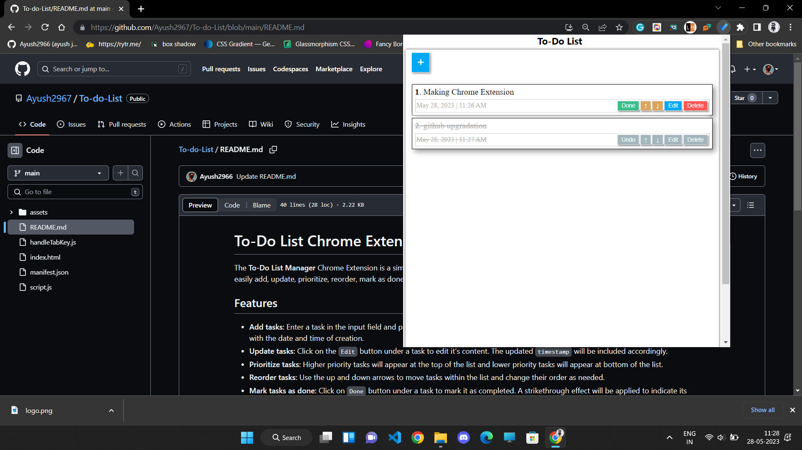

# To-Do List Chrome Extension

The **To-Do List Manager** Chrome Extension is a simple yet powerful tool for managing your daily tasks efficiently. With this extension, you can easily add, update, prioritize, reorder, mark as done, and delete tasks right from your browser.

## Features

- **Add tasks:** Enter a task in the input field and press `Add Task` button to add it to your to-do list. Each task is automatically `timestamped` with the date and time of creation.
- **Update tasks:** Click on the `Edit` button under a task to edit it's content. The updated `timestamp` will be included accordingly.
- **Prioritize tasks:** Higher priority tasks will appear at the top of the list and lower priority tasks will appear at bottom of the list.
- **Reorder tasks:** Use the up and down arrows to move tasks within the list and change their order as needed.
- **Mark tasks as done:** Click on `Done` button under a task to mark it as completed. A strikethrough effect will be applied to indicate its completion.
- **Undo tasks:** If you marked a task as done by mistake, simply click on it again to undo the completion status.
- **Delete tasks:** Remove tasks from your to-do list by clicking on the `Delete` button next to each item. The task will be deleted after confirmation for security.

## Installation

To use the My ToDo List Chrome Extension, follow these steps:

1. Download the extension files from the Realeases section (source code) zip.
2. Extract the downloaded files to a local folder on your computer.
3. Open the Google Chrome browser.
4. Type `chrome://extensions` in the address bar and press Enter.
5. Enable the "Developer mode" toggle switch at the top right corner of the page.
6. Click on the "Load unpacked" button.
7. Select the folder where you extracted the extension files.
8. The My ToDo List extension will now be installed and ready to use.

## Usage

Once the My ToDo List Chrome Extension is installed, follow these instructions to manage your tasks:

1. Click on the extension icon in the Chrome toolbar to open the to-do list interface.
2. To add new task click on the + icon and enter task details in the input field and click on Add Task button.

## Preview

 Made by Ayush Jain with ❤️

